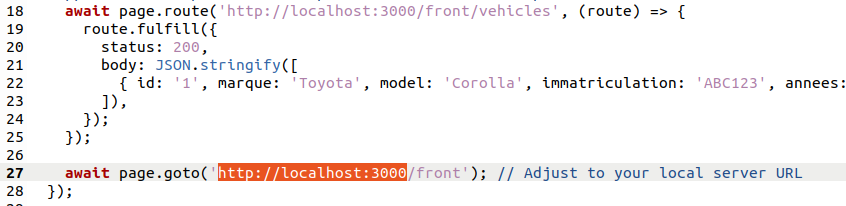
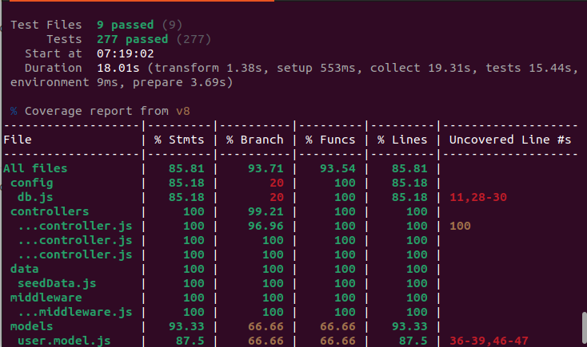

# 🚗 PROPELIZE - Application de location de véhicules

**PROPELIZE** est une application web de gestion de location de véhicules développée dans le cadre du projet de fin de semestre du cours **INF352** à l’Université de Yaoundé I.
```
1. scroll after structure section for install process for fast hand-taking
2. scroll after install section for better knowledge of the project
```
## STRUCTURE DU PROJET (de base)
inf352-propelize-groupe-2-jack-final
├── API_DESIGN.md
├── app.js
├── config
│   └── db.js
├── controllers
│   ├── auth.controller.js
│   ├── user.controller.js
│   ├── vehicle.controller.js
│   └── vitest.config.js
├── coverage (appear after npm run ```test:unit``` or ```npm run test``` operation)
│   ├── base.css
│   ├── block-navigation.js
│   ├── config
│   │   ├── db.js.html
│   │   └── index.html
│   ├── controllers
│   │   ├── auth.controller.js.html
│   │   ├── index.html
│   │   ├── user.controller.js.html
│   │   └── vehicle.controller.js.html
│   ├── coverage-final.json
│   ├── data
│   │   ├── index.html
│   │   └── seedData.js.html
│   ├── favicon.png
│   ├── index.html
│   ├── middleware
│   │   ├── auth.middleware.js.html
│   │   └── index.html
│   ├── models
│   │   ├── index.html
│   │   ├── user.model.js.html
│   │   └── vehicle.model.js.html
│   ├── prettify.css
│   ├── prettify.js
│   ├── routes
│   │   ├── auth.routes.js.html
│   │   ├── index.html
│   │   ├── user.routes.js.html
│   │   └── vehicle.routes.js.html
│   ├── sort-arrow-sprite.png
│   ├── sorter.js
│   └── tests
│       ├── helpers
│       │   ├── index.html
│       │   └── testUtils.js.html
│       └── unit
│           └── vehicles
│               └── testConfig
│                   ├── index.html
│                   └── vehicleTestParameters.js.html
├── data
│   └── seedData.js
├── documentation
│   └── test plan documentation
│       └── HERE WILL BE THE TEST PLAN.txt
├── front
│   ├── index.html
│   ├── playwright.config.cjs
│   ├── script.js
│   ├── styles.css
│   └── tests
│       └── propelize.spec.js
├── index.http
├── index.js
├── indexU.http
├── logger.js
├── middleware
│   ├── auth.middleware.js
│   └── logger.js
├── models
│   ├── user.model.js
│   └── vehicle.model.js
├── package.json
├── package-lock.json
├── README.md
├── routes
│   ├── auth.routes.js
│   ├── user.routes.js
│   └── vehicle.routes.js
├── setupTest
│   └── setupTests.js
├── test-results
├── tests
│   ├── controller
│   │   └── unit
│   │       ├── auth.controller.test.js
│   │       ├── user.controller.test.js
│   │       └── vehicle.controller.test.js
│   ├── helpers
│   │   └── testUtils.js
│   ├── integration
│   │   └── routes.test.js
│   ├── middleware
│   │   └── unit
│   │       └── auth.middleware.test.js
│   ├── seedData
│   │   └── unit
│   │       └── seedData.test.js
│   ├── server.test.js
│   ├── setup.js
│   └── unit
│       └── vehicles
│           ├── routes
│           │   ├── vehicle.routes.check-live.test.js
│           │   └── vehicle.routes.check-op.test.js
│           ├── testConfig
│           │   └── vehicleTestParameters.js
│           └── unitaire_casdetestsvehicules.md
├── utils
│   ├── initializeDatabase.js
│   ├── initializeTestDatabase.js
│   └── pairwiseGen.js
├── vitest.config.js
├── vitest.unit.config.js
└── WORKFLOWgitpush.md

```
(SECTION INSTALLATION SINON SCROLLER PLUS BAS POUR DETAILS DE L"APPLICATION)
```
# SI VOUS ETES SUR UBUNTU 

## ⚙️ Installation et démarrage


### 1. Cloner le dépôt
``` 
git clone https://github.com/marcset1/inf352-propelize-groupe-2.git
```
### s y deplacer
``` 
cd inf352-propelize-groupe-2-main
```
### 2. Base de donnée
Changer les informations de connexion a postgres via bd.js qui se trouve dans le dossier config/db.js et .env a la racine
```
1. .env pour preciser les informations de production dans votre sgbd
2. db.js -> preciser le nom de la bd de test (test_vehicle_db) dans votre sgbd
```


 modifier également les informations du fichier ```.env.test``` en fonction des votres  pour la persistance des donnees de test
 
### éléménts importants (outre les BDD, les ports et les hotes a creer) à modifier 
 
 le nom de l'utilisateur de la bd : ```DB_USER``` dans .env et ```DB_USER``` dans .env.test
 le mot de passe du dit utilisateur: ```DB_PASSWORD``` dans .env et ```DB_PASSWORD``` dans .env.test

# 3. Installer les dépendances

```
npm install
```
[] si erreur

	[] supprimer ```package-lock.json, node_modules``` 

	[] reinstaller les dependances.. ```npm install```


# 4. Tu veux démarrer le serveur backend ?
``` 
npm start
```

# 5. Tu veux ouvrir le frontend ?
Ouvrir front/index.html dans ton navigateur

# 6. Ahnn tu es pour les test frontend  !
## va sur le dossier du frontend
```
cd front/
```
## install le necessaire de test (ici):
```
npx playwright install
```
## Il est vraiment preferable de servir les fichiers du front pour faciliter le test
[] utiliser `http-server`
```http-server```

[] utiliser `serve` via le gestionnaire de paquet `snap`
```
serve . -p <votre-port-libre-ici>
```

[] utiliser python
```
python -m http-server <votre-port-libre-ici>
```

Sur Le port 8080

## dans la ligne 27 du fichier de test `front/propelize.spec.js` 
[] ajouter l'url complete obtenu pour servir le front avec l'une des commandes(section precedente)

##lance le test
```
npx playwright test
```


# 7. Ou plutot pour le Backend
[] Test unitaire avec vitest

	[] ```npm run test:unit```

	![resulat:] affiche la couverture par niveau et en pourcentage puis cree ou modifie le dossier ```coverage/``` a la racine
[] Test integration avec vitest + supertest

	[] ```npm run test:integration```

	![resultat:] affiche la proportion de fichiers et de tests executes
[] Tu n'es pas du genre a te casser la tete::tu prends tout une fois

	[] ``` npm run test ```

	

#SI VOUS ETES SUR WINDOWS

## ⚙️ Installation et démarrage


# 1. Cloner le projet
git clone https://github.com/votre-projet/propelize.git
cd propelize

# 2. Installer les dépendances

npm install

# 3. créer votre bd posgresql 

# 4. Démarrer le backend

npm start

# 5. Ouvrir le frontend (double-cliquer ou via PowerShell)

start front/index.html


## 📌 Fonctionnalités

### 🔐 Authentification
- Inscription des utilisateurs
- Connexion sécurisée
- Rôles : `admin` et `utilisateur simple`

### 🚙 Gestion des véhicules
- Création, lecture, modification et suppression de véhicules (CRUD) — réservée aux administrateurs
- Recherche par immatriculation (admin)
- Consultation de la liste des véhicules (utilisateur simple)

### 👤 Gestion des utilisateurs
- CRUD des utilisateurs (admin)
- Affichage du profil utilisateur (utilisateur simple)

## 🏗️ Architecture

- **Backend** : Node.js + Express
- **Frontend** : HTML/CSS/JS classique
- **Base de données** : posgresql
- **Authentification** : JWT
- **Tests** : Vitest & Playwright

##  Structure du projet
inf352-propelize-groupe-2-jack/
├── .env      # Variables d'environnement                      
├── .env.test        # Variables pour tests                 
├── .gitignore                    
├── API_DESIGN.md       # Schéma de conception de l’API REST            
├── WORKFLOWgitpush.md            
├── README.md                    
├── app.js   # Point d'entrée principal                     
├── index.js                      
├── logger.js                     
├── vitest.config.js              
├── docker-compose.test.yml        
├── index.http                    
├── indexU.http                   
│
├── config/                    # Configuration (BD)
│   └── db.js                     
│
├── controllers/                    # Logique métier
│   ├── auth.controller.js         
│   ├── user.controller.js        
│   └── vehicle.controller.js     
│
├── routes/                        # Définition des routes API
│   ├── auth.routes.js            
│   ├── user.routes.js            
│   └── vehicle.routes.js         
│
├── data/                       #Fichiers de seed
│   └── seedData.js                
│
├── front/                      # Interface utilisateur
│   ├── index.html                
│   ├── styles.css                
│   ├── script.js                 
│   ├── playwright.config.js      
│   └── tests/
│       └── propelize.spec.js       # Tests de l’interface 
│
└── tests/                          # tests backend 
    └── (Vitest test files)


📘 Licence

Projet académique développé dans le cadre du cours INF352 à l’Université de Yaoundé I.


